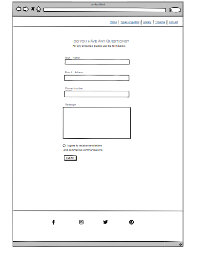

# Guitars history

[View the live project here](https://mariaarnesson.github.io/portfolio1-guitars_history-website/)

Guitars History Website is  a static front-end site to present useful information to users created for Portfolio Project 1 - HTML/CSS Essentials for Diploma in Full Stack Software Development at [Code Institute](https://codeinstitute.net/se/). 

On this website user can find the history of a very popular musical instrument, which is the guitar. It is described where the guitar comes from and in which countries it is used, and also what different types of guitars exist. There is a photo gallery and timeline about the entire history of guitars too. 

The site will be useful for people who want to get acquainted with the history of guitars and can also sign up  and provide their e -mail address to receive news letter. 

# Table of content

- [User Experience (UX)](#user-experience-ux)
    - [Site owner's goal](#site-owners-goal)
- [Features](#features)
    - [Existing Features](#existing-features)
    - [Features Left to Implement](#features-left-to-implement)
- [Design](#design)
    - [Wireframe](#wireframe)
    - [Colour Adobe](#colour-adobe)
- [Testing](#testing)
    - [validator testing](#validator-testing)
    - [Testing Lighthouse](#testing-lighthouse)

# User Experience (UX)

## Site owner's goal:
- First time visitor goals:
    - as a new user I want to find information and learn more about the history.
    - as a new user I want to easily understand the main purpose of the site.
    - as a new user I want to be able to easily navigate the entire site to find content.
    - as a new user I want to be able to easily navigate to and see what types of guitars are available.
    - as a new user I want to be able to see images in the gallery.
    - as a new user I want to be able to fill out the form to receive newsletters on my e-mail.

- Returning visitor goals:
    - as a returning user I want to be able to access and view the entire page quickly and easily.
    - as a returning user I want to be able to quickly and easily check what kinds of guitars exists.
    - as a returning user I want to be able to contact the organization to give feedback or ask questions.
    - as a returning user I want to check the history and date in case I have forgotten it.

# Features
## Existing Features
- Navigation bar
    - The navigation bar is easy to read and looks pleasent. Featured on all five pages. the full responsive navigation bar includes links to the Home page, Type of guitars, Gallery, Timeline, and Contact page and is identical in each page to allow for easy navigation.On mobile screens, the sites are next to each other and on the iPod screen, the sites in the navigation bar are covered by a button.  All menu elements are highlighted on hover. The navigation bar will allow the user to easily navigate from page to page on all devices without returning to the previous page using the "Back" button.

    
    
    

- Home Page
    - After the page loads, a picture of a man with a guitar is shown as the main picture that introduces the text about the history of guitars.    

    

- Introduction text
    - Scrolling down a few words from the author is introducing and setting out what the website is presenting and the general history is being told.

    

- Home Page Guitars Photos
    - The next part of the main page shows four photos of guitars nicely arranged in a quadrangle, on the smaller screen the photos are arranged one above the other.

    
    

- Footer
    - In the footer there are four icons showing links to four different platforms such as: facebook, instagram, twitter, pinterest. Thanks to these platforms, the user can be updated and check information about the history of guitars.

    - The background of the footer is slightly darker to show the contrast between the icons in a distinctive way.

    

- Types of guitars
    - Types of guitars page gives a list of four most popular types of guitars. There is described which country the guitars come from, what types of music they belong to and in what dates they were created.

    
    

- Gallery Page
    - On the gallery page there is a quote where the famous guitarist Jimi Hendrix talks about playing the guitar. Next to it is a photo of the guitarist, and underneath eight more photos with guitars.

    

- Timeline Page
    - At the top of the timeline page is the main photo. Below is a timeline where events and dates related to guitars around the world are described chronologically.
    - Dates and event titles are written in bold type.
    - The timeline is composed in green shades and each event is marked with a circle to easily and clearly distinguish subsequent events from each other.

    
    

- Contact Page 
    - On the contact page, the user has the opportunity to fill out a form to leave a comment on the site and to consent to the sending of information by e-mail.
    

## Features which could be implemented in the future:
- video supporting the facts:
    - By adding a video about the history of guitars, the user could learn more about guitars and listen to guitar playing.

# Design
## Wireframe: 
- Wireframe Desktop:
    - Home Page
    

    - Types of Guitars
    

    - Gallery Page
    

    - Timeline Page
    

    - Contact Page
    

    - Thank You Page
    

- Wireframe iPad
    - Home Page
    

    - Types of Guitars
    

    - Gallery Page
    

    - Timeline Page
    

    - Contact Page
    

    - Thank You Page
    

- Wireframe iPhone   

   

    - Types of Guitars
    

    - Gallery Page
    

    - Timeline Page
    

    - Contact Page
     

    - Thank you Page
    

## Colour Adobe

The background color is chosen in a light color to make the contrast between text, photos and background clearly visible.

## Typography

- Google Fonts were used to import Caveat, Courier and Sans fonts into styles.css. They were chosen because "Caveat" goes well with the quote and "Courier New" and "Sans" go well together and match the text on the history page.

# Testing 

Testing information can be found in separate [testing.md](testing.md) file. 

# Deployment:
- The site was deployed to GitHub pages. The steps to deploy are as follows:
    - In the GitHub repository, navigated to the Settings tab.
    - From the tab in the left hand side sidebar, select Pages.
    - Afrerword select main under branch. 
    - Click the save button.
    - The page had updated. 
    - The live link can be found here - https://mariaarnesson.github.io/portfolio1-guitars_history-website/

# Technologies Used
## Languages Used
- [HTML](https://sv.wikipedia.org/wiki/HTML)
- [CSS](https://en.wikipedia.org/wiki/CSS)

## Frameworks, Libraries and Programs Used:

- [Balsamiq](https://balsamiq.com/) was used to create wireframes.
- [Font Awesome](https://fontawesome.com/) was used to create icons to footer.
- [Google Fonts](https://fonts.google.com/?preview.text=Love%20Running&preview.text_type=custom) was used to import 'Caveat', 'Courier New' och 'Sans' that have been used for each page.
- [Git](https://git-scm.com/) was used  by utilising the Gitpod terminal to commit to Git and Push to GitHub.
- [GitHub](https://github.com/) was used as a repository for code of the project. 

# Credits

## Content:
- Information about history of guitars was taken from these websites:
    -  [Wikipedia](https://en.wikipedia.org/wiki/Musical_instrument)
    -  [Britannica](https://www.britannica.com/art/guitar)
    -  [Stage Music Center](https://stagemusiccenter.com/)

## Code:
- Code on how to create column in html was taken from this site: [Create columns in html](https://www.educative.io/answers/)

## Media:
- All pictures in my project were downloaded from [Pexels](https://www.pexels.com/sv-se/) :
    - [The main home page photo](https://images.pexels.com/photos/1183095/pexels-photo-1183095.jpeg?auto=compress&cs=tinysrgb&w=1260&h=750&dpr=1)
    - [Guitar strings- Home Page](https://images.pexels.com/photos/1010518/pexels-photo-1010518.jpeg?auto=compress&cs=tinysrgb&w=600)
    - [Playing the guitar- Home Page](https://images.pexels.com/photos/2444860/pexels-photo-2444860.jpeg?auto=compress&cs=tinysrgb&w=600)
    - [Guitar in a horizontal position- Home Page](https://images.pexels.com/photos/54133/pexels-photo-54133.jpeg?auto=compress&cs=tinysrgb&w=600)
    - [Guitar in an upright position- Home Page](https://images.pexels.com/photos/63694/pexels-photo-63694.jpeg?auto=compress&cs=tinysrgb&w=600)
    - [Guitarist- Gallery Page](https://images.pexels.com/photos/2444860/pexels-photo-2444860.jpeg?auto=compress&cs=tinysrgb&w=600&lazy=load)
    - [Man playing the guitar- Gallery Page](https://images.pexels.com/photos/1407322/pexels-photo-1407322.jpeg?auto=compress&cs=tinysrgb&w=600)
    - [Guitar- Gallery Page](https://images.pexels.com/photos/33597/guitar-classical-guitar-acoustic-guitar-electric-guitar.jpg?auto=compress&cs=tinysrgb&w=600)
    - [Bass guitar- Gallery Page](https://images.pexels.com/photos/165971/pexels-photo-165971.jpeg?auto=compress&cs=tinysrgb&w=600)
    - [Guitar photographed from the top- Gallery Page](https://images.pexels.com/photos/1205062/pexels-photo-1205062.jpeg?auto=compress&cs=tinysrgb&w=600)
    - [Strings- Gallery Page](https://images.pexels.com/photos/592751/pexels-photo-592751.jpeg?auto=compress&cs=tinysrgb&w=600)
    - [Acoustic guitar- Gallery Page](https://images.pexels.com/photos/459797/pexels-photo-459797.jpeg?auto=compress&cs=tinysrgb&w=600)
    - [Guitar photographed from below- Gallery Page](https://images.pexels.com/photos/159266/guitar-electric-guitar-les-paul-epiphone-159266.jpeg?auto=compress&cs=tinysrgb&w=600)
    - [Electric guitar- Gallery Page](https://images.pexels.com/photos/210779/pexels-photo-210779.jpeg?auto=compress&cs=tinysrgb&w=600)
    - [Timeline- Timeline Page](https://images.pexels.com/photos/11082253/pexels-photo-11082253.jpeg?auto=compress&cs=tinysrgb&w=600)
    - [Guitar in maroon color- Contact Page](https://images.pexels.com/photos/376452/pexels-photo-376452.jpeg?auto=compress&cs=tinysrgb&w=600)

## Designe
-  [Designe Website](https://www.typewolf.com/site-of-the-day/third-west-studio) - This website was the inspiration for my project. The background was used in a similar shade of color and the "hr" element was used in some places to divide the page.

- [Font Awesome](https://fontawesome.com/icons/dumbbell?s=solid&f=classic) - The icons in the footer were taken from this site
