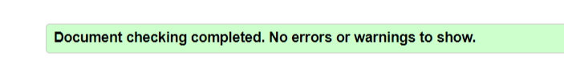

# Guitars History - Testing details

[Main README.md file](README.md)

[View the live project here](https://mariaarnesson.github.io/portfolio1-guitars_history-website/)

## Table of Contents

## Automated Testing

### Validator Testing

- [HTML Validator](https://validator.w3.org/#validate_by_input)

    - result for index.html
        - 
        - [Result index html part 1](test/test_validator/result_validator_index_part1.png)
        - [Result index html part 2](test/test_validator/result_validator_index_part2.png)
    - result for types_of_guitars.html
        - 
        - [Result Types of guitars html part1](test/test_validator/result_validator_types_part1.png)
        - [Result Types of guitars html part2](test/test_validator/result_validator_types_part2.png)
    - result for gallery.html
        - 
        - [Result Gallery html part1](test/test_validator/result_validator_gallery_part1.png)
        - [Result Galley html part2](test/test_validator/result_validator_gallery_part2.png)
    - result for timeline.html
        - 
        - [Result Timeline html part1](test/test_validator/result_validator_timeline_part1.png)
        - [Result Timeline html part2](test/test_validator/result_validator_timeline_part2.png)
        - [Result Timeline html part3](test/test_validator/result_validator_timeline_part3.png)
    - result for contact.html
        - 
        - [Result Contact html part1](test/test_validator/result_validator_contact.png)
        - [Result Contact html part2](test/test_validator/result_validator_contact_part2.png)

# Visitor Stories

As a visitor to The history of guitars I expect/want/need:

- The position structure and purpose of a navigation bar:
    - A navigation bar is placed at the top of the website.
    - The navbar shows the user appropriate links

- The position structure and purpose of a footer:
    - Social media links are provided in the footer.

- The position structure and purpose of a Home Page:
    - On the Home Page there is a main picture and two sections. 
    - The first section contains the introductory text and the second section contains four pictures. 
    - The font is adapted to be legible and visible to users. 
    - Text and pictures are centered to make the structure easy to read.

- The position structure and purpose of a Types of guitars Page:
    - On this page there is one section with four divs where each of the divs describes each type of guitar. 
    - The text is centered and the font is clear and readable for the user.

- The position structure and purpose of a Gallery Page:
    - At the top of the page is a photo of the guitarist and a quote where the guitarist talks about playing the guitar.
    - Below is one section with a series of different pictures of guitars.  

- The position structure and purpose of a Timeline Page:
    - At the top is one image centered in a clear way so that the user can easily understand what the page is about.
    - Underneath there are several divs in them text and date. Every other one is on the left and every other one is on the right.
    - The date font is bold and in a different font than the rest of the text        

## Testing User Experience (UX) stories 

- As a new user I want to find information and learn more about the history.
    - After loading the website, there is a clear navigation bar at the top of the page that allows the user to easily navigate to all the platform that exist on the page.
    - Information about the history of guitars is easily to found on the main page and also on the Types of guitars page. 
    - Additional information can be found by contacting the website author on the contact page.
    - The user will find information and learn about the history of guitars by scrolling down or pressing another button in the navigation field
- As a new user I want to easily understand the main purpose of the site.
    - The main purpose of the site is visible on the first page where you can see a photo of a man with a guitar and text about guitars below. 
    - No matter what page the new visitor lands on, they can easily find and use the navigation bar.
- As a new user I want to be able to easily navigate the entire site to find content.
    - Navigating the entire site to find content is possible by scrolling down.
    - The user has access to five buttons in the navigation bar.

- As a new user I want to be able to easily navigate to and see what types of guitars are available. 
    - The ability to easily navigate and check what types of guitars are available is possible by pressing the types of guitar button
- As a new user I want to be able to see images in the gallery. 
    - the ability to view photos in the gallery is available by pressing the gallery button.
- As a new user I want to be able to fill out the form to receive newsletters on my e-mail. 
    - filling out the form to receive newsletters to my e-mail is possible by pressing the contact button.
- As a returning user I want to be able to access and view the entire page quickly and easily. 
    - quick and easy access to the entire site and browsing it is available on all pages and using the navigation bar can be done in a quick way.
- As a returning user I want to be able to quickly and easily check what kinds of guitars exists. 
    -  - The ability to easily navigate and check what types of guitars are available is possible by pressing the types of guitar button
- As a returning user I want to be able to contact the organization to give feedback or ask questions. 
    - the possibility of contacting the organization in order to provide feedback or ask questions is possible by pressing the contact button and contacting by phone using the number provided on this page.
- As a returning user I want to check information about the history and date in case I have forgotten it. 
    - information about the history and date can be checked by pressing the timaline button and searching in the text provided on this page.